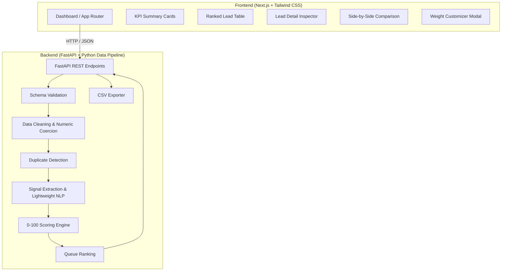

# LeadLens — AI-Assisted Lead Qualification & Prioritization

> Modern B2B Lead Prioritization Platform built with **Next.js**, **Tailwind CSS**, and **FastAPI**.
>
> **Core question:** “Which leads should I contact first, and why?”

---

## 1. Architecture Overview

LeadLens transforms raw, unorganized B2B lead data into a ranked, explainable priority queue.



---

## 2. Key Features

- **⚡ Instant Demo Dataset**: Pre-loaded 60 synthetic B2B lead dataset covering High Priority (80+), Good Opportunity (60-79), Review (40-59), and Low Priority (0-39) leads across diverse industries.
- **📥 Custom CSV Upload**: Upload any B2B CSV list with schema validation checking required columns and gracefully handling missing optional fields.
- **🎯 Deterministic 0–100 Scoring Engine**: Transparent 100-point scoring model across 7 weighted dimensions:
  - **Company ICP Fit**: 25 pts
  - **Growth Signal**: 20 pts
  - **Funding Signal**: 15 pts
  - **Revenue & Size Fit**: 15 pts
  - **Executive Decision Maker**: 10 pts
  - **Technology Relevance**: 10 pts
  - **Data Quality & Hygiene**: 5 pts
- **🔍 Lead Inspector ("Why This Lead?")**: Detailed score breakdown bars, positive signal checklists (`✓`), potential concern warnings (`⚠️`), and action recommendation card (*"Contact first"*, *"Review and contact"*, *"Research further"*, *"Deprioritize"*).
- **⚔️ Side-by-Side Lead Comparison**: Compare two selected leads side-by-side.
- **⚙️ Live Weight Customizer**: Adjust scoring parameters on the fly and re-score leads dynamically.
- **📥 Outreach CSV Export**: Download prioritized CSV results ready for sales outreach tools.

---

## 3. Technology Stack

| Layer | Technology | Description |
|---|---|---|
| **Frontend** | Next.js 14 (App Router) | React Framework with Server & Client components |
| **Styling** | Tailwind CSS + Lucide Icons | Responsive modern dark theme styling |
| **Language** | TypeScript (Frontend) / Python 3.11 (Backend) | Full end-to-end type safety |
| **Backend** | FastAPI + Uvicorn | High-performance asynchronous REST API |
| **Data Processing**| Pandas + NumPy | Fast tabular data cleaning and coercions |
| **Testing** | pytest | Automated unit testing for pipeline & API endpoints |

---

## 4. REST API Endpoints

| Method | Endpoint | Description |
|---|---|---|
| `GET` | `/health` | Health check endpoint returning API status |
| `GET` | `/api/demo-leads` | Returns synthetic demo leads, validation report, and KPIs |
| `POST` | `/api/upload` | Receives CSV file upload, validates, cleans, scores, and ranks leads |
| `POST` | `/api/score` | Re-scores dataset with custom weight overrides |
| `POST` | `/api/export` | Generates downloadable CSV string from current lead queue |

---

## 5. Repository Structure

```text
leadlens/
├── backend/
│   ├── main.py                # FastAPI REST endpoints
│   ├── requirements.txt       # fastapi, uvicorn, python-multipart, pandas, numpy, pytest
│   ├── src/
│   │   ├── config.py          # Weights, ICP rules, title & keyword dictionaries
│   │   ├── data_loader.py     # CSV loading & schema validation
│   │   ├── preprocessing.py    # Text cleaning, numeric coercions, duplicate detection
│   │   ├── signal_extractor.py# Signal extractions & keyword NLP
│   │   ├── scoring.py         # 0-100 scoring engine & explainability
│   │   ├── ranking.py         # Queue ranking engine
│   │   └── exporter.py        # CSV export generator
│   └── tests/
│       ├── test_api.py        # FastAPI endpoint tests
│       ├── test_preprocessing.py
│       └── test_scoring.py
├── frontend/
│   ├── app/
│   │   ├── layout.tsx         # Next.js Root Layout
│   │   ├── page.tsx           # Main LeadLens Dashboard
│   │   └── globals.css        # Tailwind CSS imports & global styles
│   ├── components/
│   │   ├── Header.tsx         # Top application header
│   │   ├── KPICards.tsx       # KPI summary cards
│   │   ├── FilterBar.tsx      # Search & filter toolbar
│   │   ├── RankedTable.tsx    # Interactive lead queue table
│   │   ├── LeadDetailInspector.tsx # "Why this lead?" panel
│   │   ├── LeadComparisonModal.tsx # Side-by-side comparison modal
│   │   ├── FileUploadControls.tsx  # Upload & demo data controls
│   │   └── WeightCustomizerModal.tsx # Live weight customizer
│   ├── lib/
│   │   └── api.ts             # API client connecting to FastAPI
│   ├── types/
│   │   └── lead.ts            # TypeScript interfaces
│   ├── package.json
│   └── tailwind.config.js
├── data/
│   └── demo_leads.csv         # 60 synthetic demo lead records
├── README.md
├── PLAN.md
├── TASK.md
└── .gitignore
```

---

## 6. Running Locally

### 1. Start FastAPI Backend

```bash
cd backend
python -m pip install -r requirements.txt
uvicorn main:app --reload --port 8000
```
FastAPI interactive docs will be available at `http://localhost:8000/docs`.

### 2. Run Backend Tests

```bash
python -m pytest backend/tests
```

### 3. Start Next.js Frontend

```bash
cd frontend
npm install # or pnpm install
npm run dev # or pnpm dev
```
Open `http://localhost:3000` in your browser.
